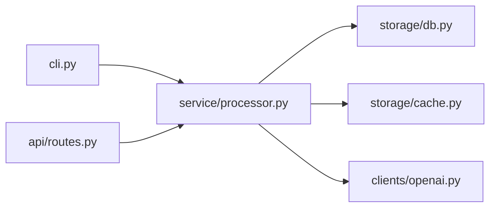
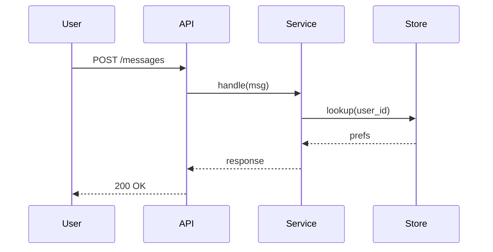

# Mental Model

## Overview

This skill produces a **compact mental model** of code. The deliverable is the smallest set of concepts, entities, and relationships such that a reader can:

- Predict, in broad terms, what happens when an operation runs.
- Know which file or module to open when they want to change a given behavior.
- Read the rest of the code productively on their own.

A mental model is defined by what it **subtracts**, not what it includes. Every function, class, and file enumerated past the load-bearing few costs the reader attention and dilutes the model. Aggressively prune.

This skill is **read-only**. It does not edit code, run formatters, or modify the repository. It produces an explanation — in chat by default, optionally saved as a markdown file if the user asks.

## When to Use This Skill

Trigger on requests like:

- "Build a mental model of <this code / this repo / this module>"
- "Explain how <X> works at a high level" / "Give me the architecture"
- "Onboard me to this codebase" / "What's the lay of the land?"
- "Map this repo" / "Draw me a diagram of how <X> connects to <Y>"
- "How is this organized?" / "Where does <behavior> live?"

Do **not** use this skill when:

- The user asks a **specific question** ("what does function `foo` return?", "why does this test fail?") — answer it directly.
- The user wants a **line-by-line walkthrough** or **full API reference** — those are exhaustive, this is reductive. Say so and offer the reductive version instead.
- The user wants the code **modified, refactored, or documented in-tree** — that's a different task. This skill outputs an explanation, not a PR.
- The codebase is **trivial** (a single short file with one obvious function) — just describe it in a sentence; running the workflow is overkill.

If the request is ambiguous — e.g. "explain this code" could mean a one-paragraph summary or a full architectural pass — ask one short clarifying question before starting (see Step 1).

## Operating Principles

These override the rest of the workflow when they conflict.

1. **Subtract aggressively.** A model with 5 boxes that a reader actually remembers beats one with 50 they ignore. Drop anything that does not change how the reader would predict behavior or navigate the code.
2. **Name load-bearing things, hide the rest.** A "load-bearing" entity is one that, if you removed your understanding of it, the rest of the system stops making sense. Everything else is supporting cast — mention it only when it appears in a diagram or flow.
3. **Concrete file paths, not vague nouns.** Every entity in the model is grounded in a real file/class/function with a path. `src/foo/processor.py:Processor` beats "the processor".
4. **Diagrams must earn their place.** A diagram is justified only when it conveys something prose cannot: a topology, a flow, a state machine. If a diagram would just be "list with arrows," delete it and use a list.
5. **One diagram per question.** Each diagram answers exactly one question ("how do the modules depend on each other?", "what happens when a request comes in?"). Do not stuff multiple concerns into one diagram.
6. **Honest about what you didn't read.** If you skimmed a module, say so. Do not extrapolate the architecture of code you did not actually open.
7. **Reader-oriented, not author-oriented.** The model describes the code as it is, not as the original author imagined it. If the docs and the code disagree, the code wins; flag the discrepancy.
8. **No padding.** Skip "this is a fascinating codebase," "as we'll see," and exhaustive taxonomies of file types. Every sentence should add information a reader can act on.

## Core Workflow

### Step 1 — Scope the model

Before reading, get three things from the user. Ask in **one short message** (use `AskUserQuestion` if multiple choices help; otherwise plain prose). Skip questions whose answers the user already volunteered.

1. **Target.** What code is the model for? The whole repo? A subdirectory? A specific subsystem (e.g. "the auth flow", "the data pipeline")? If unspecified, default to the current repo and confirm.
2. **Audience & goal.** Who reads the model and what do they need to do next? A new contributor onboarding, a reviewer evaluating a change, a maintainer planning a refactor — each shifts which details are load-bearing.
3. **Depth budget.** A one-paragraph summary, a one-page model, or a deeper dive across multiple subsystems. This sets how many entities make the cut.

If the user says "just go," make assumptions explicit in one line ("Assuming whole-repo, onboarding a new contributor, one-page model — say if that's wrong"), then proceed.

### Step 2 — Read enough to know what to subtract

The deliverable of this step is **internal notes**, not user output. The point is to read enough breadth that you know what's load-bearing and what isn't.

**What to read first** (in this order):

1. **Project metadata.** `README.md`, `pyproject.toml` / `package.json` / equivalent, `CLAUDE.md`, top-level docs. These often state the purpose explicitly.
2. **Directory layout.** `ls`/`tree` the target. The directory structure encodes the author's intended decomposition; note it.
3. **Entry points.** Where execution starts: `__main__.py`, `main.go`, CLI commands declared in `pyproject.toml`/`setup.cfg`, HTTP route registrations, scheduled jobs, test fixtures. Follow them inward.
4. **Public API surface.** What does the package expose? `__init__.py` re-exports, top-level functions/classes, CLI subcommands. The public surface is usually a good proxy for what's load-bearing.
5. **The biggest / most-imported files.** Use `find`/`wc -l` or `rg` to find files everything else imports from. These are usually core abstractions or shared types.

**What to extract** for each candidate entity:

- One-sentence statement of what it is and what it does.
- Who uses it (callers, imports) and who it uses (dependencies).
- Whether it is **load-bearing** — does removing it from the model break the reader's ability to predict behavior or navigate the rest of the code?
- The canonical file path and, where useful, the class/function name.

**Distillation.** With all candidates on the table, rank by load-bearing. Aim for:

- **One-paragraph model**: 1–3 entities, 1 sentence each, no diagram.
- **One-page model**: 4–8 entities, 1–2 diagrams, 1 short flow.
- **Deep dive**: 8–15 entities at the top level, with selective drill-downs into sub-models for the most complex parts. Rarely more than 15 at any single level.

Drop anything that:

- Is a utility / helper used in one place (mention only if it appears in a diagram).
- Is configuration plumbing without behavior (settings loaders, logging setup) unless the user's goal explicitly involves them.
- Is test/fixture code unless the goal is "how do we test this?".
- Is generated, vendored, or third-party code adapted in-tree (call it out as a black box and move on).

### Step 3 — Sketch the model plan

Before producing the full deliverable, share a one-screen plan with the user. Format:

```
Mental model of <target>, aimed at <audience/goal>:

Purpose: <one sentence>

Entities I'll cover:
1. <Entity> (<path>) — <one-line "what it does, why it earns inclusion">
2. <Entity> (<path>) — ...
...

Diagrams I'll draw:
- <one-line description of each diagram and what question it answers>

Flows I'll trace:
- <one-line description of each end-to-end flow>

Want me to adjust scope or proceed?
```

This serves two purposes: lets the user redirect ("skip the CLI, I know that part" / "go deeper on the storage layer"), and commits you to a finite model instead of drifting into an exhaustive walkthrough.

If the user says "go," proceed to Step 4. If they redirect, update the plan and confirm once.

### Step 4 — Build the model

Produce the deliverable, in chat by default. Use the structure below. Save it to a file (e.g. `MENTAL_MODEL.md` or a path the user names) only if the user explicitly asks.

**1. Purpose** — one or two sentences. What does this code exist to do, in the language of the domain (not the language of the implementation). Example: "Serves an HTTP API that maps incoming chat messages to LLM completions, with caching and rate limiting." Not: "A FastAPI app with Redis and OpenAI client."

**2. Shape** — one diagram showing the high-level architecture. See "Diagram Guidance" below. This is the picture a reader keeps in their head. If a single picture doesn't fit, the scope is too broad — split or shrink.

**3. Key entities** — the 4–8 (or fewer) load-bearing things, in a numbered list. For each:

- **Name** and **path**: `Processor` (`src/foo/processor.py`)
- **Role**: one sentence, in the domain's language.
- **Owns**: what state or responsibility it holds.
- **Talks to**: which other entities it calls or is called by.
- **Read this first**: the one file / class / function inside it a reader should open first.

**4. Key flows** — 1–3 end-to-end traces that connect the entities. Each flow answers a "what happens when…" question, with a small sequence diagram or numbered list. Choose flows that exercise the load-bearing entities — typically the happy path of the primary use case, plus one error or boundary path if it's structurally different.

**5. Where things live** — a short "map" telling the reader where to look for things they'll plausibly want to change:

| Want to change… | Look in… |
|---|---|
| <a behavior or feature> | `path/` |
| <config / wiring> | `path/` |
| <the data model> | `path/` |
| <tests for X> | `path/` |

Keep this to ≤ ~6 rows. It's a navigation aid, not a directory listing.

**6. What this model leaves out** — one short paragraph naming the major things you deliberately did not include and why (e.g. "Skipped the migration scripts and the legacy `v1/` directory; both are slated for removal and don't affect current behavior."). This is the trust-builder: the reader knows the model is reductive on purpose, not by accident.

**7. Going deeper (optional)** — only if the user's depth budget allows: 2–4 pointers to where to read next, in order, one line each. ("Next read: `src/storage/cache.py` for the eviction policy; that's the only non-obvious piece left.")

### Step 5 — Adapt on feedback

After delivering, expect redirection:

- **"Go deeper on entity X"** → produce a sub-model for X with the same structure, scoped to that entity's internals.
- **"You missed Y"** → either add it (if load-bearing) or explain why you left it out (if it isn't). Don't silently bloat the model.
- **"The diagram doesn't match what I see"** → re-read; if the code disagrees with your diagram, the code wins. Update.
- **"Save this to a file"** → write to the path the user names (default `MENTAL_MODEL.md` at the repo root), once, without restructuring.

## Diagram Guidance

Diagrams use **Mermaid** by default — it renders inline in GitHub, GitLab, VSCode, and most chat clients, and is text-reproducible. If the user's environment cannot render Mermaid, fall back to ASCII art or a labeled list of relationships, and say so.

### Choosing a diagram type

| Question the diagram answers | Use |
|---|---|
| "How do the major modules depend on each other?" | `flowchart` (a.k.a. `graph`) with boxes for modules, arrows for "depends on" |
| "What happens when a request / call / event flows through?" | `sequenceDiagram` |
| "What are the key data shapes and how do they relate?" | `classDiagram` or `erDiagram` |
| "What states can this entity be in, and how does it transition?" | `stateDiagram-v2` |
| "What's the directory layout?" | A plain text tree, not a diagram. |

### Examples

A module dependency sketch:



A request flow:



### Anti-patterns to avoid

- **"Everything connected to everything."** If your `flowchart` has > ~12 nodes or every node touches every other, the model is too coarse — split it, or you're showing the file tree, not the architecture.
- **Decorative diagrams.** A diagram that restates a list ("A, then B, then C") is noise. Use the list.
- **Implementation noise in architectural diagrams.** Helper utilities, logging, formatters, decorators rarely belong in the top-level shape diagram. They are supporting cast.
- **Diagrams that duplicate each other.** If two diagrams convey the same relationships from slightly different angles, keep the clearer one.
- **Unlabeled arrows.** Every arrow means something specific: "calls", "depends on", "writes to", "subscribes to". Label them when more than one kind of arrow appears.
- **Mermaid syntax the renderer can't handle.** Stick to the common subset (`flowchart`, `sequenceDiagram`, `classDiagram`, `stateDiagram-v2`). Avoid experimental diagram types unless the user has explicitly asked for them.

## Edge Cases & Failure Modes

| Case | Behavior |
|---|---|
| Codebase too large to read end-to-end | Sample by entry points and the most-imported files. Be explicit in the deliverable about what you read vs. inferred from structure. |
| Codebase has no clear structure (one giant file, or a flat dump) | Say so. The model becomes "what coherent pieces can be carved out", and the deliverable's "Where things live" is more valuable than the diagrams. |
| Code is generated or vendored | Treat as a black box. Note its presence, do not enumerate its internals. |
| Docs / README contradict the code | The code wins. Note the discrepancy in "What this model leaves out" so the reader knows the docs are stale. |
| Multiple languages in one repo | Build one model per language/subsystem, with a top-level "how these connect" if they do. Don't force a unified picture if there isn't one. |
| Tests are the clearest description of behavior | Use them — point readers at the most informative tests as part of "Read this first" for the relevant entity. |
| User wants the model written to a file | Save once, exactly as delivered. Do not restructure or expand on write. Default path `MENTAL_MODEL.md` at the target's root unless the user specifies otherwise. |
| User pushes for more detail mid-delivery | Offer a sub-model for the specific entity, not a global expansion. Keep the top-level model small. |
| User asks for the model in a non-Mermaid format (ASCII, PlantUML, Graphviz) | Honor it. Mermaid is the default, not a requirement. |

## Quality Control Checklist

Before ending the task:

- [ ] **Purpose** is stated in the domain's language, in one or two sentences.
- [ ] The model lists the **smallest** set of load-bearing entities — every entity earns its place by appearing in a diagram or a flow.
- [ ] Every entity is grounded in a **concrete file path** (and class/function where useful).
- [ ] Every **diagram answers exactly one question** and contains only entities named in the model.
- [ ] Each diagram has ≤ ~12 nodes; arrows are labeled if more than one kind exists.
- [ ] **Flows** trace through the named entities — no surprise components appear mid-flow.
- [ ] "**Where things live**" is ≤ ~6 rows and covers what a reader is *likely* to want to change.
- [ ] "**What this model leaves out**" honestly names what was dropped and why.
- [ ] No file was claimed to be understood without being opened.
- [ ] No padding, no exhaustive taxonomies, no decorative diagrams.
- [ ] No code was modified.
