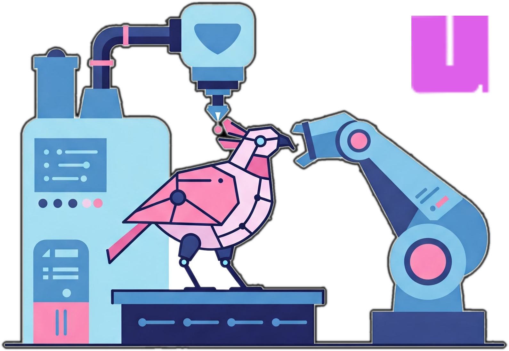

How To Use
---



1. Use this repo as a template to create a new repo on GitHub. Name the repo with a 4 digit year-of-initiation prefix, e.g., "2022-". Convention is to use hyphens between words and all lower case.
2. Insert description here.
3. Clone your new repo locally to get started. Create a [conda](https://www.anaconda.com/) environment for this project.  First modify `conda-env.yml` to include the relevant repositories and dependencies needed; also give the environment a good name (e.g., similar or same as this repo) - the default is "project-env". Then create the environment (see below).
4. If you do not want to work in a development container, skip to "Local Installation" to use a conda environment on your local machine.
5. Otherwise, a Docker [dev container](https://code.visualstudio.com/docs/devcontainers/containers) template for [VS Code](https://code.visualstudio.com/) is provided in the `.devcontainer/` folder.  This creates a [miniconda](https://docs.anaconda.com/miniconda/) container and installs the environment specified in `conda-env.yml` into the default IPython kernel in the container. To use:
   * Change the `UID` and `GID` in `.devcontainer/Dockerfile` if needed.
   * Optional: If you want to connect to other containers, e.g., running ollama for code assitance in [Continue](https://docs.continue.dev/), you might need to consider [Docker networking](https://docs.docker.com/engine/network/tutorials/standalone/). You can skip this in which case ollama will bind to your localhost at your chosen port on the default "bridge" network, which is acceptable on personal devices.
   * Add [additional arguments](https://containers.dev/implementors/json_reference/) as needed, e.g., "runArgs": ["--gpus", "all"] to [access host gpus](https://stackoverflow.com/questions/25185405/using-gpu-from-a-docker-container). This is helpful if you are doing deep learning in the container/project. You may have to install the appropriate drivers first.
   * Change the name of the conda environment (default="project-env") in the `conda-env.yml` and files in .devcontainer/.
   * Install the "Dev Containers" Extension in VS Code.
   * First `git clone` this repo, then [open the folder in the container](https://code.visualstudio.com/docs/devcontainers/containers#_quick-start-open-an-existing-folder-in-a-container) by selecting "Dev Containers: Open Folder in Container" from the Command Palette.
   * From a terminal in VS Code, (1) navigate to your desired starting point (`data/analysis` is recommended), then (2) run `$ bash /path/to/.devcontainer/start_jupyter.sh` to launch a Jupyter server (forwarded on port 1234 by default) from the head of the repo.  The default kernel contains the `conda-env.yml` packages but is not renamed.

Local Installation
---

Set up the conda environment for this project. You will need to install the environment in your Jupyter to use it (third command below). Change the name of the conda environment (default="project-env") in the `conda-env.yml` if you wish.

```code
$ conda env create -f conda-env.yml
$ conda activate project-env
$ python -m ipykernel install --user --name=project-env
```

At the end of a project it is good practice to export the entire conda environment for posterity, especially if not working in a development container.
```code
$ conda env export > environment.yml
```

This environment can be recreated later; the `conda-env.yml` file can also be exchanged for this, but I prefer to keep both as a record.
```code
$ conda env create -f environment.yml
```

This works for many cases, but if you need an *exactly reproducible* environment use [conda-lock](https://github.com/conda/conda-lock) instead.

Contributors
---

Update the CITATION.cff file to enable appropriate citations.  

The logo for this repository (logo.png) was generated using Google Gemini 2.0 Flash (Imagen 3) on Feb. 19, 2025 with the prompt "Create a logo of a robotic bird being designed and templated by a robot in a factory."

Versioning
---

* Use the [public-template](https://github.com/mahynski/public-template) to create a fresh repo to release the code and details after a project is finished, tag the release, then use zenodo to capture changes to future changes/releases made to that repo, if a public record is desired. That serves as the primary **public** repo which is shared with external parties.
* In addition, create a "published" branch on this repo to correspond to when the associated results/paper/report was first published or shared. This repo is retained as the primary **private** version where future work can be performed. Subsequent branches, such as "revision-YYYY-MM-DD" can be created later and similarly reflected in the public-template version if revisions are necessary. 

Associated Publications
---

[LINK TO REPORT]()
